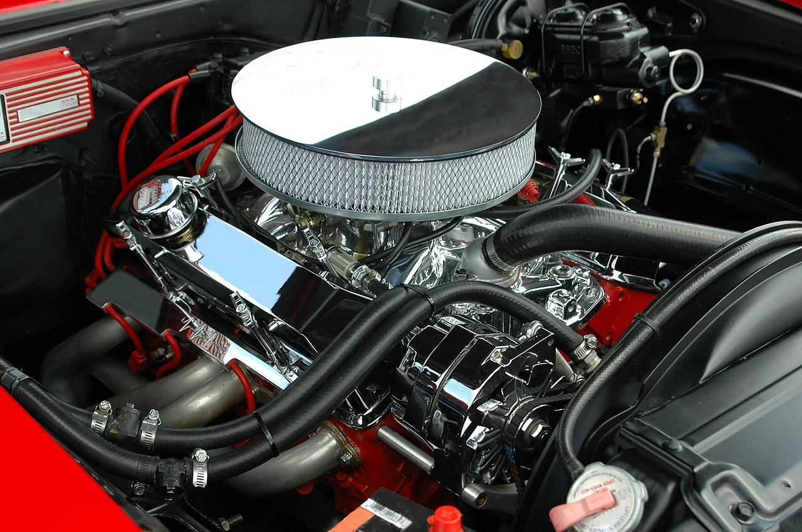

# (PART) Core Lessons {-}

# Introduction to R and RStudio {#Intro}

R is the underlying statistical computing environment. You can think of this like the engine of a car. That makes RStudio like the dashboard^[Credit to [Modern Dive](https://moderndive.com/) for the R and RStudio analogies].

{width=250px} {width=250px}

RStudio is an integrated development environment (IDE) that allows us to interact with R. RStudio sits on top of R and makes writing and executing R code a lot easier. We'll be benefiting from many of the added features that come with RStudio and we will point them out as we go.

## Panes in RStudio

When you open RStudio, you will have access to R (there is no need to open R directly). 

Now go to the top menu to open a new R Script File --> New File --> R Script

Great! Now you will see four panes

- I have mine set up as follows:
    - Editor / script / source in the top left
    - Console bottom left
    - Environment/history on the top right
    - Plots/help on the bottom right
    
{width=400px}
    
- On the top left is the **script** or editor window. This is where we are going to write all of our code.

- On the lower left we have the **console** window. This is where R is running, and this is what you would see if you opened R instead of RStudio. In this pane we can see the code we send and then the answer.

- The top right has the **environment** and history tabs. The Environment is a list of all objects that are saved in memory. The History tab shows all commands that have been run.

- On the bottom right hand side there's a window with several tabs.
    - **Files** shows the file structure of the working directory.
    - **Plots** is where your visualizations will appear. 
    - Packages shows all of the installed packages where checked ones are loaded and unchecked packages are not loaded.
    - **Help** shows information about functions.
    - Viewer for viewing other kinds of output, like web content.

To change your preferences for the pane layout go to Tools --> Global Options --> Pane Layout. The Global Options menu is also where you can change the font size, background color, and other useful preferences.

There is one preference that we recommend you change right now. That is the _soft wrap_ feature that will wrap long lines of code or comments onto several lines so that you do not need to scroll right to see the whole code or sentence. Go to Tools --> Global Options --> Code and click the box next to _Soft Wrap R Source files_

# Set up an R Project

I mentioned previously that RStudio has a lot of pretty handy features. One of those is the project structure

Before we can start writing code we need to set up a project so that the data and our codes will be in the same place. Go to File --> New Project--> New Directory. I will name mine IntroR and it will be a folder on my desktop

{width=350px}

Now we have opened up a new instance of RStudio running inside the IntroR folder. Notice on the top of the console pane and the Files pane (bottom right) that the path to the IntroR folder is specified.

When we start reading in data it will be important that the _code and the data are in the same place._ Creating a project creates an Rproj file that runs R  _in that folder_. If you are familiar with working directories, this process is setting the working directory for this project as this folder. 

Once you have a project set up, when you want to read in dataset _whatever.txt_, you will be able to easily specify the path pointing to _whatever.txt_ rather than having to specify a full path. This is critical for reproducibility, and we'll talk about that more later.

## Download learning materials

To get things arranged for later, please download the dataset we are going to use. Right click --> Save link as to download the file to your computer.

[gapminder data set](data/gapminder.csv)

Move the dataset to your IntroR directory in a subfolder called **data**.

{width=450px}

Now that we have a project directory and the dataset inside that project directory, let's open up a new script and begin coding! Go to File --> New --> New R Script

Code that you type into the console is code that R executes. From here forward we will use the editor window to write a script that we can save to a file and run it again whenever we want to. We usually give it a `.R` extension, but it's just a plain text file so it can be opened by any text editor program. 

# R as a calculator

R can be used as a calculator. Make sure you're typing into into the editor, not the console. Use the run button in the top right of the script to run the code.

```{r calculator}
2 + 2
```

Notice the output in the console that tells us the code we wrote and the answer. Let's try some others.

```{r}
5 * 4
2 ^3
```

Instead of using the Run button to run code, let's try the keyboard shortcut to run code. To send code from the editor to the console, use `CMD`+`Enter` (Mac) or `Ctrl`+`Enter` (Windows). This is **way** faster than using your mouse to hit the Run button each time.

Go back to your code above and run them using the keyboard. We can also run multiple lines of code at once. Now highlight 2 lines of code and run them together.

R also knows order of operations and scientific notation.

```{r calculator2}
(5 + 3)^2
5 + 3^2

5e4
```

## Comments

Anything after a `#` sign is a comment, meaning it will not be executed as code. Use them liberally to *comment about what you are doing and why*. 

Today, you can take notes about what you are learning as comments in your script.

Comments are a big part of making your work reproducible for others and for your future self when you open this script a few months from now and need to remember what you were doing.

Commenting is also helpful when you're testing things out during your analysis so that you can 'turn off' parts of your script. 

```{r}
# Here is a comment
# Note that anything after the # is considered a comment
```

Let's save our script before we get any further.

Go up to File --> Save As and let's go with "intro.R"

## Creating R objects

Let's learn to create R objects next. We assign _values_ to _objects_ using the assignment operator "<-". This arrow is typed with a less than sign followed by a dash. We first name the object on the left and then provide the assignment operator `<-`, and then the value.

Let's create an object called thing1 that takes the value 55.

```{r assignment}
thing1 <- 55
```

Look in the Environment pane (top right) to see your new R object!

`<-` is the assignment operator in R. It assigns values on the right to object names on the left. Think of it like an arrow that points from the value to the object. The `<-` is mostly similar to `=` but not always. Learn to use `<-` as it is good R programming practice. Using `=` in place of `<-` can lead to issues down the line. The keyboard shortcut for inserting the `<-` operator is `option + dash`(Mac) and `Alt + dash` (Windows).

- Objects can be given any name such as `x`, `current_temperature`, or `subject_id`, but they may not have a space in the name. You want your object names to be explicit and not too long. They also cannot start with a number (`2x` is not valid but `x2` is). R is case sensitive (e.g., `thing1` is different from `Thing1`). 

```{r case sensitive}
Thing1 <- 60
```

Look in the Environment pane to see that there are now 2 different thing1 objects since we used different casing in the spelling of the object names.

There are some words that should not be used as object names because they represent the names of functions in R. It is best to not use function names as object names since it will be confusing to tell the difference between the object and the function (e.g., `c`, `T`, `mean`, `data`, `df`, `weights`). 

If in doubt, start typing the name and if RStudio suggests something it already knows, then that name is already in use. 

For example, it is perfectly reasonable to think that data is a great name for your dataset but as you start to type it, the autocomplete function in RStudio tells you that `data` already exists.

```{r data}
data()
```

Try to use nouns for object names, and verbs for function names to help yourself remember what each item is.

When assigning a value to an object, R does not print anything. You can ask to print the value by typing the object name:

```{r printAssignment}
thing1
```

We can overwrite the value of thing1 by re-assigning it

```{r reassign}
thing1 <- 70

#then call its name to see the object
thing1
```

----

## EXERCISE 1.1

Try these on your own

A. You have a patient with a height (inches) of 73 and a weight (lbs) of 203. Create r objects labeled 'height' and 'weight'.

<details><summary>SHOW ANSWER A</summary>

```{r ex1A}
height <- 73
weight <- 203

height
weight
```

</details>

B. Convert 'weight' to 'weight_kg' by dividing by 2.2. Convert 'height' to 'height_m' by dividing by 39.37

<details><summary>SHOW ANSWER B</summary>

```{r ex1B}
weight_kg <- weight / 2.2
height_m <- height / 39.37

weight_kg
height_m
```

</details>

C. Calculate a new object 'bmi' where BMI = weight_kg / (height_m*height_m)

<details><summary>SHOW ANSWER C</summary>

```{r ex1C}
bmi <- weight_kg / (height_m * height_m)
bmi
```

</details>

----

You can remove objects from the environment using the `rm()` function. You can do this one at a time or remove several objects at once by separating their names with `,`. The broom button in the Environment pane will remove all objects from your environment.

```{r rm}
rm(weight, Thing1)
# Now ask R for weight (uncomment the following line and run it)
# weight
# oops! you should get an error because weight no longer exists!
```

# Functions

A function is a verb; it tells R to do something. To call an R function, we call the name of the function followed directly by `()`. The items passed to the function inside the () are called *arguments*. Arguments change the way a function behaves

Some functions don't need any arguments
```{r date, eval=FALSE}
Sys.Date() #get today's date
```

Some functions just take a single argument. Let's get the square root of 961. Now let's get the square root of object1
```{r sqrt}
sqrt(961)
```

To learn more about the function, type `?` and then the function's name

```{r helpsqrt,eval=FALSE}
?sqrt
```

Sometimes functions have arguments that have a default value. In those cases, you can override the default value by specifying your own.

For example, let's look at the help page for the `rnorm()` function
```{r helprnorm, eval=FALSE}
?rnorm
```

`rnorm()` generates random values from the normal distribution. We must supply the n argument since there is no default value, but there is a default value set for the mean and sd arguments.

First we'll allow the default mean and sd.

```{r rnorm1}
rnorm(n = 10)
```

The above code drew 10 random draws from a normal distribution with a mean = 0 and an sd = 1     

Now let's set the n = 10, mean = 50, and the sd = 5 to see 10 random draws from a normal distribution with a mean = 50 and an sd = 5
```{r rnorm2}
rnorm(n = 10, mean = 50, sd = 5)
```

What happens if we do not specify n? Uncomment the code below (remove the #) to see what happens

```{r rnorm3}
# rnorm(mean = 50, sd = 5)
```

In the above examples, we have labeled our arguments according to their names in the help menu. If you do not label the arguments, they will be called into the function in the order given in the help menu.

```{r}
# must be in order given by help menu to work as intended
rnorm(10, 50, 5)

#out of order, but works bc the arguments are labeled
rnorm(n = 10, sd = 5, mean = 50)
```

To improve readability (and accuracy) of your code, we would recommend labeling your arguments.

## EXERCISE 1.2

A. Use the arrow operator to create an object called object2 that stores 100 draws from a normal distribution with mean = 500 and sd = 100.

<details><summary>SHOW ANSWER A</summary>

```{r ex2A}
object2 <- rnorm(n = 100, mean = 500, sd = 100)
object2
```

</details>

B. Call `hist(object2)` to create a histogram of your normal distribution

<details><summary>SHOW ANSWER B</summary>

```{r ex2B}
hist(object2)
```

</details>

------------------------------------

Look at the environment. What does it tell you about object2?

The environment pane provides details about objects. We can see that object2 is a numeric object with items 1 through 100. Then we can see the first few numeric items in the object.

Let's create some more R objects that are collections of several values. To accomplish this, we will use the function `c()`, which stands for concatenate or combine. Usually functions are named with a full word describing what they do but because combining items together is so common, this function gets a very short name.

```{r}
object3 <- c(55, 60, 35, 70)
```

Check out the environment now. It worked! We created object3

Let's create another object containing a different type of data

```{r}
object4 <- c("Jack", "Leila", "Rohit")
```

Check out the environment now. Notice that it specifies that object4 is a character (chr) vector

# More Functions

Let's `sum()` everything in object3

```{r}
sum(object3)
```

Try the `mean()` function on object3

```{r}
mean(object3)
```

What happens if we try to `sum()` object4? Uncomment the code below to try it

```{r}
#sum(object4)
```

What if we take the square root of object3? The `sum()` and `mean()` functions both take a vector and return one number. What about `sqrt()` where we want multiple answers given multiple inputs?

```{r}
sqrt(object3)
```

It worked! Most functions in R are **vectorized** meaning that they will work on a vector as well as a single value. This means that in R, we usually do not need to write loops like we would in other languages.

## EXERCISE 1.3

Try the following functions on object3 and on object4. What do each of the below functions do? Optionally, call up the help menu for these functions to learn more.

A. class()
B. length()
C. summary()
D. str()

<details><summary>SHOW ANSWER</summary>

The `class()` function provides information about the type of object
```{r}
class(object3)
class(object4)
```

`length()` tells us how many items are in each vector

```{r}
length(object3)
length(object4)
```

`summary()` provides a summary of an object. In the case of object3, we have a 6 number numeric summary describing the minimum, 1st quartile, median, mean, 3rd quartile, and maximum. For object 4, `summary()` tells us that the object is a character

```{r}
summary(object3)
summary(object4)
```

Finally, `str()` provides the structure of an object. For object3 and object4 `str()` returns the same information that we see in the environment, but for more complex objects, `str()` can be very helpful 

```{r}
str(object3)
str(object4)
```

</details>

# DataFrames

Let's move on to learning about dataframes. There are _lots_ of different basic data structures in R. Besides the dataframe, there are also arrays, lists, matrices, etc. We are going to skip those in favor of spending time learning the data structure you'll probably use most -- the **dataframe**. 

We use dataframes to store _heterogeneous tabular_ data in R: _tabular_, meaning that individuals or observations are typically represented in rows, while variables or features are represented in columns; _heterogeneous_, meaning that columns/features/variables can be different classes (a variable like age, can be numeric, while another, like cause of death, can be a character string). 

# R Packages

We have the gapminder.csv file into our project directory, but we don't know anything about it yet. Our goal will be to read it into R so we can start exploring it.

There are lots of ways to load data into R. There is a point-and-click RStudio menu and go to File > Import Data Set > Import From Text File but that is not the most reproducible way to read in data.

Instead, we would prefer that you read data into R for analysis as part of your script.

I gave you the gm dataset as a csv file. "csv" stands for comma separated values. You can save any Excel, SPSS, Qualtrics, etc. data file as a .csv and then import it into R. This is the workflow that we would recommend.

To read a csv file into R, we are going to use a function `read_csv()` that is accessed from a package. 

You can think of an R package like an app on your phone. Fist, we will need to install it from the internet. 

When we call the `install.packages()` function, R goes to the Comprehensive R Archive Network (CRAN) and downloads the specified package. There are over 10K packages listed on CRAN, over 1500 on Bioconductor (bioinformatics packages), and many more under development on people's github pages etc. You can be sure a package is safe to download if it comes from the CRAN or from Bioconductor.

Uncomment the line below to run the `install.packages()` function

```{r}
# install.packages("tidyverse")
```

Once we have installed it to this computer, you will not need to do that again (until you update R or your OS, etc). Therefore, comment out the install line.

The `library()` command loads the functions from that package into the R environment so that we can use them. This is like opening the app. We will need to do this every time we open the script.

```{r}
library(tidyverse)
```

We can see based on the output from the `library(tidyverse)` line that the tidyverse is actually a megapackage, containing 8 packages. All of these packages share a similar syntax in an attempt to simplify coding and readability for R users. Aside from the core tidyverse packages, there are around 10 other packages

Ok! Now let's write the line of code to read the csv file into R. We will use the `read_csv()` function that comes from the readr package (one of the tidyverse packages). 

At the beginning of the session, we asked you to save the gm file into the data directory of your project file, so when we write the path to the gm file, we'll specify that it is in the data folder.

```{r gm}
gm <- read_csv("data/gapminder.csv")
```

If the above line did not work for you, follow the steps to create an R project with the gm file in a subdirectory called data.

Assuming you were able to load the data, let's move on!

Let's look at this object by calling its name

```{r}
gm
```

Because we read in the data using `read_csv()`, the dataframe was read in as a modified dataframe called a tibble. Printing tibbles to the console looks great, but that used to not be the case. If you'd like to learn more about the difference between dataframes and tibbles please see the [tibbles section of R for Data Science](https://r4ds.had.co.nz/tibbles.html)

Let's also use the `View()` function to look at the data. Note that this is a read only viewer - not like Excel where you can go in and change cell values etc. This feature helps with reproducibility.

```{r, results="hide"}
View(gm)
```

Let's go back to the script. Your script is still there. It is in a tab next to the viewer tab. 

The third way to look at a dataframe or tibble is to click on the blue arrow next to the gm name in the Environment. 

{width = 400px}

This view enables you to see the variable names and classes while you type code, so this is often what my environment looks like.

# Inspecting Dataframes

There are several functions that are useful for investigating dataframes. We already saw some of them in the section on Functions above.

Instead of printing the whole dataframe to the console, we can print an abbreviated version using `head()` and `tail()`. By default, these functions give us the first and last 6 rows respectively

```{r}
head(gm)
tail(gm)

# see the first 12 rows using the n = argument
head(gm, n = 12)
```

Remember, `class()` tells us the type of object

```{r class}
class(gm)
```

We can see that gm is a dataframe and a tibble (tbl)

We can look at the number of rows and columns with `dim()`, just the number of rows with `nrow()` and just the number of columns with `ncol()`

```{r}
dim(gm)
nrow(gm)
ncol(gm)
```

`names()` will show us the column names

```{r}
names(gm)
```

And probably the two you'll use the most to inspect data frames, because they are the most descriptive, are `summary()` and `str()`. Let's start with `summary()`

```{r}
summary(gm)
```

Notice that the output depends on the type of column. For country, a character vector, we get a frequency count of the number of occurences of the first few countries. Same for continent. The other columns are numeric, so their summary is a six number summary showing the minimum, 1st quartile, median, mean, 3rd quartile, and the maximum.

The `read_csv()` determined what type of column each one was while we were reading in the data. Of course, there are arguments to change the type of column within the `read_csv()` function.

Let's look now at the structure of gm.

```{r}
str(gm)
```

The structure tells us that gm is a dataframe and tibble object and it specifies the dimensions. Below that, it also gives us each of the column names with the type of data it contains and the first 4 or 5 values for each column. 

# Accessing variables

Notice in the `str()` output that there is a `$` in front of each of the variable names. That symbol is how we access invidual variables / columns / vectors from a dataframe object

To access a variable from a dataframe, the syntax we want is `dataframe$columnname`

Let's use this to print out all of values in the `pop` variable. First we call the dataframe, then $ and the variable name

```{r dollar, results="hide"}
gm$pop
```

Whoa. That function calls the whole column, which is 1704 observations long. Usually printing out a long vector or column to the console is not useful. Maybe we meant to call `head()` on one column

```{r}
head(gm$pop)
```

What if we want to see the first 20 country values? 

```{r}
head(gm$country, n = 20)
```

Nice! We can also use the $ to create a new variable and attach it onto our dataframe.

First let's look at the first 20 values of the pop column
```{r}
head(gm$pop, n = 20)
```

Let's say I would like a column where the population is in millions. We'll take the original gm$pop and divide by 1e6 then save it as a new column on the dataframe.

```{r}
# dataframe$newvar <- dataframe$oldvar / 1e6
gm$popmill <- gm$pop / 1e6

#head of the new column
head(gm$popmill)
```

Great!

Using this `$` syntax, let's calculate some descriptive statistics for life expectancy in the gm dataset. 

Notice that the `lifeExp` variable is mixed case, so be careful in spelling. However, RStudio's autocomplete function can help. Once you type the `gm$` RStudio autocompletes with the options for variable names so you can just select from the list.

```{r}
mean(gm$lifeExp)
sd(gm$lifeExp)
range(gm$lifeExp)
```

----

## EXERCISE 1.4

A. What's the standard deviation of the population variable (hint: get help on the `sd` function with `?sd`)
B. What's the mean gdpPercap? 
C. What's the range of years represented in the data?
D. Run a summary on the lifeExp column

<details><summary>SHOW ANSWERS</summary>

```{r}
sd(gm$pop)

mean(gm$gdpPercap)

range(gm$year)

summary(gm$lifeExp)
```

</details>

----

While the gm dataset is fully complete (no missing values), in real life, dataframes often come with missing values. For basic statistical functions like mean, sd, etc., there is an argument `na.rm` that we can use to remove missing values prior to calculating the statistic.

In this case, the result will not change because we do not have any missings, but in case your dataset does, here is what the code would look like

```{r}
# calculate the mean population
mean(gm$pop)

#calculate the mean population after removing missings
mean(gm$pop, na.rm = TRUE)
```

# Subset a dataframe using filter()

Often we want to look at just a subset of the data that meet certain criteria. One really nice way to do this is the `filter()` function from the dplyr package. The dplyr package is one that we loaded when we loaded the tidyverse.

**filter() subsets rows** of a dataframe. 

The first argument to `filter()` is the dataframe we are filtering from and the second argument is the logical condition(s) the row must meet to be returned

There are six basic logical operators in R
-equal to **==**
-not equal to **!=**
-greather than **>**
-greater than or equal to **>=**
-less than **<**
-less than or equal to **<=**

You can chain multiple conditions together with the AND operator **&** or the OR **|** operator

Let's see how it works by filtering for rows where the population is over 70Million. The first argument is the dataframe and the second is the logical criteria a row must meet to be returned. I'll choose to use my new popmill variable

```{r}
filter(gm, popmill > 70)
```

We do not need to specify `gm$popmill` because the first argument told R we would be operating within the gm dataframe. Therefore, we need only specify the variable name in the second argument.

118 rows meet this criteria. 

Now let's see rows belonging to the United States. First let's use `View()` to see how USA is spelled. Click on the country column header to sort by country to quickly scroll to the _U_ section.

```{r, eval=FALSE}
View(gm)
```

Ok, now that we know how it is spelled, we can write a line of code to filter for where country is 'United States'. We need the quotes because country is a character (factor) variable.

```{r}
filter(gm, country == 'United States')
```

Now let's return the data that meets multiple criteria at once. We'll use the `&` to combine the year == 1982 and country == "United States" criteria

```{r filter}
filter(gm, year == 1982 & country == 'United States')
```

We'll do one more together before you will practice on your own. Let's filter the gm dataset for rows where the population is higher than 1 billion (1e9). This time, let's start with the original pop variable

```{r}
filter(gm, pop > 1e9)
```

---

## EXERCISE 1.5

Use the `filter()` function to return rows matching the given criteria.

A. Which rows have life expectancies of more than 80 years (>80)?

<details><summary>SHOW ANSWER A</summary>

```{r ex5A}
filter(gm, lifeExp > 80)
```

</details>

B. Which countries had a low GDP per capita (< 500) in 2007?

<details><summary>SHOW ANSWER B</summary>

```{r ex5B}
filter(gm, gdpPercap < 500 & year == 2007)
filter(gm, year == 2007 & gdpPercap < 500) 
# order doesn't matter
```

</details>

C. Which rows have extremely low GDP per capita (< 300) OR extremely low life expectancy (< 30)?

<details><summary>SHOW ANSWER C</summary>

```{r ex5C}
filter(gm, gdpPercap < 300 | lifeExp < 30)
```

</details>

----

# Plots in base R

Plots are a great way to help us explore our dataset to see relationships, investigate interactions, diagnose problems, etc.

Here we will introduce plotting using base R (without loading any extra packages). Chapter 2 is all about plotting using the premier plotting package in R, ggplot2. Jump to /@ref(ggplot)

Let's start out with a histogram of the life expectancy variable from gm.

```{r hist1}
hist(gm$lifeExp)
```

R decided how many breaks to insert in the above histogram, but we can set that manually using the `breaks = ` argument.

```{r hist2}
hist(gm$lifeExp, breaks=100)
```

We can also change the color of the bars using `col = `.

```{r hist3}
hist(gm$lifeExp, breaks=100, col='blue')
```

If we wanted to look at more than one numeric variable we could try a scatterplot. The syntax for `plot(dataframe$varX, dataframe$varY)`

```{r plot2}
plot(gm$gdpPercap, gm$lifeExp)
```

The default plotting character in base R is an open circle, which I dislike. Let's change that using the `pch = ` argument, which stands for plotting character. pch ranges from 0 - 25 and you can easily search for what each looks like on the internet. I'll change mine to `pch = 16`, a filled-in circle.

```{r}
plot(gm$gdpPercap, gm$lifeExp, pch = 16)
```

Next, I would like to change the color of the points to red using `col = "red"`
```{r buildplot}
plot(gm$gdpPercap, gm$lifeExp, pch = 16, col = "red")
```

You can see the names of all 657 base R colors
```{r, eval=FALSE}
colors()
```

To add a title, the argument is `main = `

```{r}
plot(gm$gdpPercap, gm$lifeExp, pch = 16, col = "red", main = "Life Exp vs GDP")
```

Finally, we'll add an xlabel and a ylabel both in quotes.

```{r}
plot(gm$gdpPercap, gm$lifeExp, pch = 16, col = "red", main = "Life Exp vs GDP", 
     ylab = "Life Expectancy (years)", 
     xlab = "Per-capita GDP ($)")
```

There are hundreds of plotting parameters you can use to customize your plot's appearance. I know these parameters because I have learned them. The internet is your friend in this case, so if you forget how to modify a parameter, don't be afraid to Google it. 

----

## EXERCISE 1.5

Create a plot to show the relationship between continent and life expectancy. Optional: Add color, axis labels, and a title

<details><summary>SHOW ANSWER</summary>

```{r}
plot(gm$continent, gm$lifeExp, pch = 16)
```

</details>

---

Visualizations are a large part of R's appeal and in our opinion, learning to plot using ggplot2 will serve you well. Therefore, we only cover the very basics of plotting using base R here, and devote more time to a more comprehensive dive into ggplot2 in Chapter 2 /@ref(ggplot2)

# Write csv file

We've already seen how to read in data using read_csv(). Now we'll do the opposite. There are going to be some cases when you need to save the data you're working on to open up outside of R.

Just like R has functions to read data of many different kinds of formats, it also has functions to write data into many different kinds of formats. We'll stick to csv format here.

First, let's create a dataframe that is a subset of gm where the year is 1997. We'll name the resulting dataframe

```{r datatowrite}
gm97 <- filter(gm, year == 1997)
```

To save this as a csv file, we will call `write_csv()` where the first argument is the R object to be written and the second argurment is the name of the proposed file.

```{r}
write_csv(gm97, "gm97.csv")
```

Where did it go? Let's have a look at the Files pane (bottom right) and there it is. It went into our working directory (project directory) automatically. We don't need to worry about our working directory here because we're using an R project.

# Saving your work and quitting R

We'll close this chapter with how to save your work. 

Our suggestion is to make sure your R script (top left) is saved and then throw out the rest. After all, the script created the objects in the environment, the output in the console, and all the plots. Remember that to save your script, go to File --> Save or `CMD + S` (mac) and `CTRL + S` (pc).

I prefer that RStudio never ask me to save my workspace (Environment, Plots, etc) so I have set that preference in Tools --> Global Options --> General. _Save workspace to .RData on exit = "never"_. While you are at it, **uncheck** the options for 1. Restore most recently opened project 2.Restore previosuly open source documents on startup 3. Restore .RData into workspace at startup

Once your script is saved, quit RStudio. 

To re-open the project and prove to yourself that all of your hard work has been preserved, double click the Rproj file to launch RStudio in your project directory. Now open your script and start running your code.

To run all the code in an R file (there have to be no errors), highlight the entire code `CMD + A` (mac) or `CTRL + A` (pc) and then run.

Woohooo! Happy Running! See you in Chapter 2.