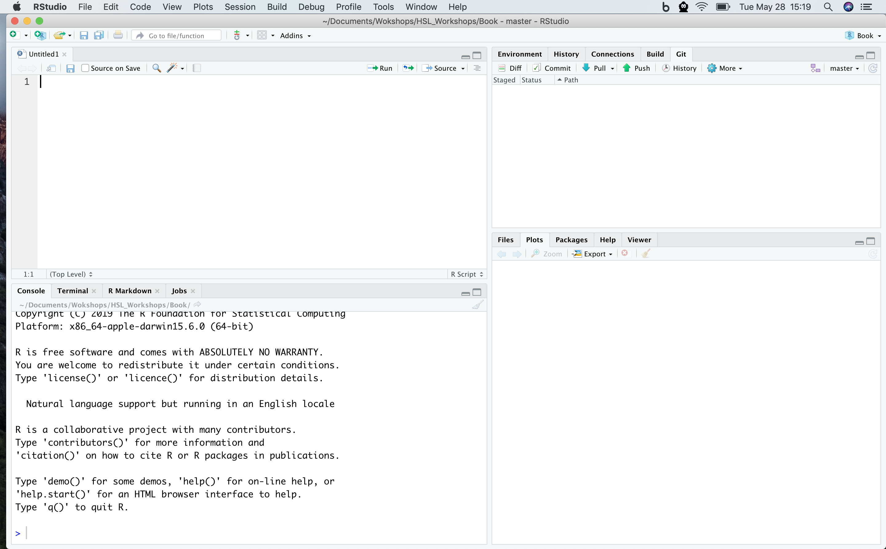

# Introduction to R and RStudio

R is the underlying statistical computing environment. You can think of this like the engine of a car. That makes RStudio like the dashboard.

{width=250px} {width=250px}

RStudio is an integrated development environment (IDE) that allows us to interact with R. RStudio sits on top of R and makes writing and executing R code a lot easier. We'll be benefiting from many of the added features that come with RStudio and we will point them out as we go.

## Panes in RStudio

When you open RStudio, you will have access to R (there is no need to open R directly). 

Now go to the top menu to open a new R Script File --> New File --> R Script

Great! Now you will see four panes

- I have mine set up as follows:
    - Editor / script / source in the top left
    - Console bottom left
    - Environment/history on the top right
    - Plots/help on the bottom right
    
{width=350px}
    
- On the top left is the script or editor window. This is where we are going to write all of our code.

- On the lower left we have the console window. This is where R is running, and this is what you would see if you opened R instead of RStudio. In this pane we can see the code we send and then the answer.

- The top right has the environment and history tabs. The Environment is a list of all objects that are saved in memory. The History tab shows all commands that have been run.

- On the bottom right hand side there's a window with Files ... that's your file structure in the working directory ... Plots (SHOW PLOTS) ... this is where your visualizations will appear ... Packages (SHOW PACKAGES) ... these are all of the installed packages ...checked are loaded. unchecked aren't ... Help (show help) ... help files are very important in R, you'll spend a lot of time here ... and Viewer for viewing other kinds of output, like web content

- To change your preferences for the pane layout go to Tools --> Global Options --> Pane Layout. The Global Options menu is also where you can change the font size, background color, and other useful preferences.

- There is one preference that we recommend you change right now. That is the _soft wrap_ feature that will wrap long lines of code or comments onto several lines so that you do not need to scroll right to see the whole code or sentence. Go to Tools --> Global Options --> Code and click the box next to _Soft Wrap R Source files_

## Set up Project and move dataset

- I mentioned that RStudio has a lot of pretty handy features ... one of those is the project structure

- Before we can start writing code we need to set up our project workspace ... go to File --> New Project--> New Directory. I will name mine IntroR and it will be a subfolder on my desktop

{width=150px}

- When we start reading in data it will be important that the _code and the data are in the same place._ Creating a project creates an Rproj file that opens R running _in that folder_. If you are familiar with working directories, this process is setting the working directory for this project as this folder. This way, when you want to read in dataset _whatever.txt_, you just tell it the filename rather than a full path. This is critical for reproducibility, and we'll talk about that more later

- Now to get things arranged for later we need to download the dataset we are going to use. Right click to download the file to your computer.

[gapminder data set](data/gapminder.csv)

- Move the dataset to your IntroR directory. You can use whatever method you need. If you're on a Mac there's the finder. In Windows, use the file browser to move the gapminder.csv file into your R project directory

- Now that we have a project and the dataset, let's open up a new script and begin coding! Go to file new --> new R script

- Code that you type into the console is code that R executes. From here forward we will use the editor window to write a script that we can save to a file and run it again whenever we want to. We usually give it a `.R` extension, but it's just a plain text file so it can be opened by any text editor program. 

## Basic operations
R can be used as a calculator. Make sure you're typing into into the editor, not the console. Use the run button in the top right of the script to run the code.

```{r calculator}
2+2
```

Notice the output in the console that tells us the code we wrote and the answer. Let's try some others.

```{r}
5*4
2^3
```

- Instead of using the Run button to run code, let's try the keyboard shortcut to run code. To send code from the editor to the console, use `CMD`+`Enter` (Mac) or `Ctrl`+`Enter` (Windows). This is **way** faster than using your mouse to hit the Run button each time.

- Go back to your code above and run them using the keyboard. We can also run multiple lines of code at once. Now highlight 2 lines of code and run them together.

## Comments

- Anything after a `#` sign is a comment. Use them liberally to *comment your code*. 
- In R, anything after the # symbol, hashtag, pound sign is a comment ... that means it won't be executed ...
- Commenting is helpful when you're testing things out during your analysis ... you can 'turn off' parts of your script
- But comments are also a big part of making your work reproducible for others and for your future self when you open this script a few months from now and need to remember what you were doing
- Use comments liberally to describe what the code does and importantly, why you want to do what you are doing

```{r}
# Here is a comment
# Note that anything after the # is considered a comment
```

- Let's save our script before we get any further

Go up to File --> Save As and let's go with "intro.R"

R also knows order of operations and scientific notation.

```{r calculator2}
(5 + 3)^2
5 + 3^2

5e4
```

Let's learn to create R objects next. We assign _values_ to _objects_ using the assignment operator "<-". This arrow is typed with a less than sign followed by a dash. We first name the object on the left and then provide the assignment operator `<-`, and then the value.

Let's create an object called weight kg that takes the value 55.

```{r assignment}
weight_kg <- 55
```

Look in the Environment pane (top right) to see your new R object!

`<-` is the assignment operator in R. It assigns values on the right to object names on the left. Think of it like an arrow that points from the value to the object. The `<-` is mostly similar to `=` but not always. Learn to use `<-` as it is good R programming practice. Using `=` in place of `<-` can lead to issues down the line. The keyboard shortcut for inserting the `<-` operator is `option + dash`(Mac) and `Alt + dash` (Windows).

- Objects can be given any name such as `x`, `current_temperature`, or `subject_id`, but they may not have a space in the name. You want your object names to be explicit and not too long. They also cannot start with a number (`2x` is not valid but `x2` is). R is case sensitive (e.g., `weight_kg` is different from `Weight_kg`). 

```{r case sensitive}
Weight_kg <- 55
```

Look in the Environment pane to see that there are now 2 different weight objects since we used different casing in the spelling of the object names.

- There are some names that cannot be used because they represent the names of fundamental functions in R (e.g., `if`, `else`, `for`). In general, even if it's allowed, it's best to not use other function names, which we'll get into shortly (e.g., `c`, `T`, `mean`, `data`, `df`, `weights`). In doubt check the help to see if the name is already in use. It's also best to avoid dots (`.`) within a variable name as in `my.dataset`. It is also recommended to use nouns for variable names, and verbs for function names to help yourself remember what each object is.

- It is perfectly reasonable to think that data is a great name for your dataset but as you start to type it the autocomplete function in RStudio tells you that data already exists
```{r data}
data()
```

When assigning a value to an object, R does not print anything. You can ask to print the value by typing the object name:

```{r printAssignment}
weight_kg
```

Now that R has `weight_kg` in memory, we can do arithmetic with it. For instance, we may want to convert this weight in pounds (weight in pounds is 2.2 times the weight in kg).

```{r modAssignment}
2.2 * weight_kg
```

We can also change a variable's value by assigning it a new one:

```{r newAssignment}
weight_kg <- 57.5
2.2 * weight_kg
```

Let's store the animal's weight in pounds in a new object

```{r calculationWithVar}
weight_lb <- 2.2 * weight_kg
```

and then we'll change `weight_kg` to 100.

```{r modAssignment2}
weight_kg <- 100
```

What do you think is the current content of the object `weight_lb`? 126.5 or 220? Why?

Check your answer

```{r}
weight_lb
```

You can see which objects are stored by looking at the Environment pane. You can also use the `ls()` function to print all the object names to the console. You can remove objects with the `rm()` function. You can do this one at a time or remove several objects at once by separating their names with `,`. The broom button in the Environment pane will remove all objects from your environment.

```{r rm, eval=FALSE}
ls()
rm(weight_lb, Weight_kg)
ls()
# weight_lb # oops! you should get an error because weight_lb no longer exists!
```

----

**EXERCISE 1**

Try these on your own before looking at the answers below!

A. You have a patient with a height (inches) of 73 and a weight (lbs) of 203. Create r objects labeled 'height' and 'weight'.

B. Convert 'weight' to 'weight_kg' by dividing by 2.2. Convert 'height' to 'height_m' by dividing by 39.37

C. Calculate a new object 'bmi' where BMI = weight_kg / (height_m*height_m)

```{r ex1}
height <- 73
weight <- 203

weight_kg <- weight / 2.2
height_m <- height / 39.37

bmi <- weight_kg / (height_m * height_m)
```

----

## Built-in Functions

R has built-in functions.

```{r fns}
sqrt(144)
log(1000)
```
- When we computed that log you may or may not have noticed that it was the natural ... base e ... log ... what if we wanted log base 10?

- Let's get help by typing a question mark in front of the function's name, or `help(functionname)`:

```{r}
help(log)
?log #same as above
```
- So going through the help file we get our answer right away in the description section

```{r log}
log(1000)
log10(1000)
log(1000, base=10)
```

- The `base=` part inside the parentheses is called an _argument_, and most functions have arguments. Arguments modify the behavior of the function. Functions need some input (e.g., some data, an object) and arguments allow for options to change what the function will return, or how to treat the data provided.

- Note syntax highlighting when typing this into the editor. Also note that I explicity told the log function the name of the `base` argument ... I didn't have to do this...

```{r without arg label}
log(1000,10)
```

- This also works just fine in this case... but it's worth pointing out that explicility calling out argument names will be necessary in some cases and improves readability of your code.

- Another note about this example ... if we had paid a little more attention to the original call to the log function then we may not have had to dig into the help at all ...

```{r autocompletion}
#log()
```

- Check out the code suggestion ... again with RStudio features ... so RStudio tells us as we type the function name what parameters it accepts ... pretty cool.

## Nesting Functions
In some cases you may need to use one function to derive the value you need to pass to another function ... if that sounds opaque maybe an example will help ...

```{r nest}
sqrt(log(1000,base=10))
```
Because sqrt() takes a number ... and because log() outputs a number ... we can nest the two together
And if we really wanted to make this a little easier to look at ... we could use the assignment operator to simplify things ... 

```{r assign}
myval <- log(1000,base=10)
sqrt(myval)
```

----

**EXERCISE 2**

See `?abs` and calculate the square root of the log-base-10 of the absolute value of `-4*(2550-50)`. Answer should be `2`.
```{r}
sqrt(log(abs(-4*(2550-50)), base = 10))
```

## Vectors

- We've talked quite a bit about objects ... but we haven't truly addressed the fact that there are many different kinds of objects
- Functions are one kind of object ... like log() or sqrt()
- Another extremely common kind of object you'll encounter in R is the vector ...
- Vectors are single objects containing an ordered collection of elements
- A simple vector is a numeric vector ... this is a single object containing more than one number
- A quick way to create a vector is to use the colon ...

```{r vector}
1:5
```

We can also do arithmetic on vectors
```{r arith vector}
1:5 + 6:10
```
- As you can see ... what's happening is that each element of the vector is being paired with its equivalent during the operation ... so 1 is added to 6, 2 is added to 7 ... and so on until you have another vector representing the results of all 5 addition operations
- Besides the colon syntax ... you can also use the c() function to create vectors

```{r cvector}
c(1,2,5)
c(1:5,11:15)
#What if we wanted to created a vector from to 2 to 200 by 4s?
?seq
seq(from = 2, to = 200, by = 4)
```

You could assign this vector to an object ... just like you would for one item
Let's try assigning a vector of animal weights to an object

```{r animal weights}
animal_weights <- c(50,60,66)
animal_weights
```
You can also create a vector that contains characters

```{r char vector}
animals <- c("mouse", "rat", "dog")
animals
```

There are a lot of functions that help you inspect a vector's contents ... length() is a good one ... it'll tell you how many elements are in a particular vector
Let's try it on animals and animal_weights

```{r length}
length(animals)
length(animal_weights)
```

Another helpful function is class() ... this will tell you what kind of object you're looking at
```{r}
class(animals)
class(animal_weights)
```

This confirms that animals is a character vector and animal_weights is a numeric vector

The str() function ... short for structure is particularly helpful ...
This function gives you an overview of the object you're interested in

``` {r str}
str(animal_weights)
str(animals)
```

- There are no suprises in this case ... but once we get to data frames and other more complex objects ... we'll see how useful str() can be

- If you wanted to extend an existing vector by an additonal element or elements you can do so with combine

```{r cvector2}
animal_weights <- c(animal_weights, 80)
animal_weights <- c(49, animal_weights)
```

- You can add elements to the beginning and end of a vector in this fashion

- By reassigning the original vector each time we are overwriting its contents with the new data

- We discussed classes a little while ago ... certain functions only operate on particular classes of objects ... for example sum will not work on characters

```{r sum vectors}
#sum(animals) errors out
sum(animal_weights)
```

## Indexing vectors
- As we definted them earlier, vectors are essentially single objects that contain multiple elements
- There may be situations where it's important to be able to access individual elements from the vector
- Let's create a vector of 50 integers from 101 to 150

```{r}
x <- 101:150
```

We can access certain elements by putting the index or indices we're interested in in square brackets

```{r}
x[1]
```

That's the first element ... note that we didn't start at 0 ... R indexing differs from many programming languages in this sense

- We can also index a vector based on another vector
```{r}
x[5:10]
```
That's the fifth through the tenth elements of x

```{r}
x[c(40,48)]
```
That's the fortieth and forty-eighth

And if we call an index beyond the available data ... R will return NA values
```{r}
x[1:150]
```

## Data Frames

Let's move on to learning about data frames.
There are _lots_ of different basic data structures in R. If you take any kind of longer introduction to R you'll probably learn about arrays, lists, matrices, etc. Let's skip straight to the data structure you'll probably use most -- the **data frame**. We use data frames to store heterogeneous tabular data in R: tabular, meaning that individuals or observations are typically represented in rows, while variables or features are represented as columns; heterogeneous, meaning that columns/features/variables can be different classes (on variable, e.g. age, can be numeric, while another, e.g., cause of death, can be text). 

## Our data

- We have the gapminder.csv file loaded into our project directory ... but we don't actually know anything about it yet
- Let's load it into R so we can start exploring it
- There are lots of ways to load data into R
- We can use the point-and-click RStudio menu and go to Tools > Import Data Set > Import From Text File ... but that's not reproducible ...
- The better way to read data in for analysis is to do so as part of your script
- There are functions in R to load many different kinds of data

- We will use the basic read.csv() function today to load the gapminder.csv file ... and because some spreadsheets have column names and some don't ... read.csv gives us the header option ... in this case we want to set header = TRUE because the file does have column headers

```{r gm}
gm <- read.csv("data/gapminder.csv")
# FYI if reading in as tibble, answer to plotting Exercise 5 will change
```

We've named the gapminder dataset gm ... and once it's loaded we can look at it by typing gm
```{r, results="hide"}
gm
```
That's pretty ugly ... printing large data sets can cause headaches
Instead, let's use the View function to look at the data. Note that this is a read only viewer - not like Excel where you can go in and change cell values etc. This feature helps with reproducibility.

```{r, results="hide"}
View(gm)
```

## Inspecting Data frames

There are several built-in functions that are useful for working with data frames. Back to our script ... we can confirm the object is a data frame by using class

```{r class}
class(gm)
```
We can output abbreviated versions of the data frame with head and tail ... by default these functions give us the first and last 6 rows respectively
```{r}
head(gm)
tail(gm)
```

We can look at the number of rows and columns with dim(), just the number of rows with nrow() and just the number of columns with ncol()
```{r}
dim(gm)
nrow(gm)
ncol(gm)
```

names() will show us the column names
```{r}
names(gm)
```

And probably the two you'll use the most to inspect data frames ... because they are the most descriptive ... summary() and str()
```{r}
summary(gm)
str(gm)
```

The structure tells us that gm has 1704 observations of 6 variables ... it also gives us the variable names and what kinds of values they contain

## Accessing variables & subsetting data frames

- You might have noticed a `$` in front of the variable names in the str() output
- That symbol is how we access invidual variables ... or columns ... from a data frame

- The syntax we want is dataframe$columnname
```{r dollar, results="hide"}
gm$pop
```

- That gives us the population column
- If we wanted to perform some math on one of the columns in particular we could access it ... then pass the result into a function
```{r}
mean(gm$lifeExp)
```

- Two things worth noting here ... the name of the variable is mixed case so we have to make sure we're careful to match up the casing ... RStudio does help us with this but it can still be tricky

-Secondly ... this isn't very interesting given that we're looking at average life expectancy across all countries and all years in the data set

- What if we wanted to look at average life expectancy for a particular subset of the data frame?

- In other words ... we might be interested in something like the life expectancy for a particular country, and how that changes over time ... Or maybe the average life expectancy across all countries, separately for each year ... Or maybe the average life expectancy for different continents.

----

**EXERCISE 3**

1. What’s the standard deviation of the life expectancy (hint: get help on the `sd` function with `?sd`)
2. What’s the mean population size in millions? (hint: divide by `1000000`, or alternatively, `1e6`).
3. What’s the range of years represented in the data? (hint: `range()`).
4. Run a correlation between life expectancy and GDP per capita (hint: `?cor()`)

----

## Filtering a data frame
- Subsetting the data is pretty easy in R. There's built-in function called subset
```{r subset}
subset(gm, subset = year == 1982 & country == 'United States')

subset(gm, subset = pop < mean(gm$pop))
```

- An even easier function to use for subsetting is the filter() function. This is loaded from the dplyr package
- Together we are going to install and load a package. You need internet for the download
```{r installpkg}
#install.packages("dplyr")
```

- Once it's installed we need to load it into the script with the library function
```{r}
library(dplyr)
```

Now we can use the filter function from this library
The first argument to filter is the data frame we are filtering from
The second argument is the first condition the resulting data will have to meet to be returned

There are six operators in total for conditions
-equal to **==**
-not equal to **!=**
-greather than **>**
-greater than or equal to **>=**
-less than **<**
-less than or equal to **<=**

And you can chain multiple conditions together with an AND operator **&** or an OR **|** operator
Let's see how it works ...

```{r}
filter(gm, year == 1982)
```
That gives us only data from 1982

```{r}
filter(gm, country == 'United States')
```
That's just the data for the US ... note the quotes around the name of the country to match type of variable (character / factor)

```{r}
filter(gm, country == 'United States' & year == 1982)
```
That's data for the United States from 1982

```{r}
filter(gm, gdpPercap < 300 | lifeExp < 30)
```

- That's data with gdpPercap was less than 300 or the life Expectancy was less than 30 ...
filter ... like all other dplyr functions ... takes a data frame and returns a data frame
- That means that you can use the same dollar sign syntax to access elements out of the results ... and then pass them into another function
- This kind of workflow helps answer specific questions about the dataset

- For example, what was the average GDP for the two countries in Oceania in 2002?
```{r}
mean(filter(gm, continent == "Oceania" & year == 2002)$gdpPercap)
```

**EXERCISE 4**

1. Which countries and years have life expectancies of more than 80 years (>80)?
```{r}
filter(gm, lifeExp > 80)
```

2. Which countries had a low GDP per capita (< 500) in 2007?
```{r}
filter(gm, gdpPercap < 500 & year == 2007)
filter(gm, year == 2007 & gdpPercap < 500)
```

## Base plotting -- histogram and scatterplot
- So now that we can access individual pieces of our data frame ... we might want to visualize what they look like ... that can help us explore interactions ... relationships ... indicators

- There are a few ways to create plots in R ... today we're just introducing base R's plot() and hist() functions ... we have several other workshops where you can get deeper into this

- Let's try plot with one of the variables and see what happens
```{r plot1}
plot(gm$lifeExp)
```

Plotting a single numeric variable goes down the rows and plots a value on the y-axis for each observation (index) in the data frame ... that's not very useful in this case ... what might be better is a histogram

```{r hist1}
hist(gm$lifeExp)
```
We can try to let R decide how many breaks to insert in the histogram, or we can set that manually. We can also set the color of the bars.

```{r hist2}
hist(gm$lifeExp, breaks=100, col='blue')
```

If we wanted to look at more than one numeric variable we could use a scatterplot ... the syntax for that is ... plot(varX, varY)
```{r plot2}
plot(gm$gdpPercap, gm$lifeExp)
```

There are hundreds of plotting parameters you can use to customize your plot's appearance
-Let's use a solid-filled point instead of an open circle with the pch= argument (point character) ... color the points red with the col= argument ... give it a title by passing a character object to the main= argument ... and change the x and y axis titles with the xlab= and ylab= arguments, respectively ... we'll go through one step at a time

```{r buildplot}
plot(gm$gdpPercap, gm$lifeExp, pch = 16)
plot(gm$gdpPercap, gm$lifeExp, pch = 16, col = "red")
plot(gm$gdpPercap, gm$lifeExp, pch = 16, col = "red", main = "Life Exp vs GDP")
plot(gm$gdpPercap, gm$lifeExp, pch = 16, col = "red", main = "Life Exp vs GDP", ylab = "Life Expectancy (years)", xlab = "Per-capita GDP ($)")
```

- I know these parameters because I have learned them ... Google is your friend in this case ... if you forget how to modify a parameter ... Google it

- Visualizations are a big part of R's appeal ... and there are a lot of people out there writing about how they use R to create their plots ... particularly with the tools some more advanced plotting features like ggplot2

**Exercise 5**
Create a plot to show the relationship between continent and life expectancy. If there is time add color, axis labels, and a title
```{r}
plot(gm$continent, gm$lifeExp)
# does not work if dataframe is a tibble

# for tibble data
boxplot(gm$lifeExp ~ gm$continent)
```

## Write out csv file of filtered dataframe
- We've already covered reading data in with read.csv() ...
- Now what about writing it out?
- There are going to be some cases when you need to save the data you're working on to open up outside of R
- Just like R has functions to read data of many differnt kinds of formats ... it also has functions to write data into many different kinds of formats

- We're sticking with csv here
- But first we need to create an object to save

```{r datatowrite}
gm97 <- filter(gm, year == 1997)
```

- This is a filter of the gm dataset by the year 1997
- If we want to save this as csv ... all we do is call write.csv() ... the first argument is the object to be written ... and the second argurment is the name of the proposed file

```{r}
write.csv(gm97, file = "gm97.csv")
```
- Where did it go? Let's have a look in Files and there it is. It went into our working directory (project directory) automatically. We don't need to worry about our working directory here because we're using an R project

- If we weren't then we would want to check our working directory with ... getwd() ... to see where the file was being saved